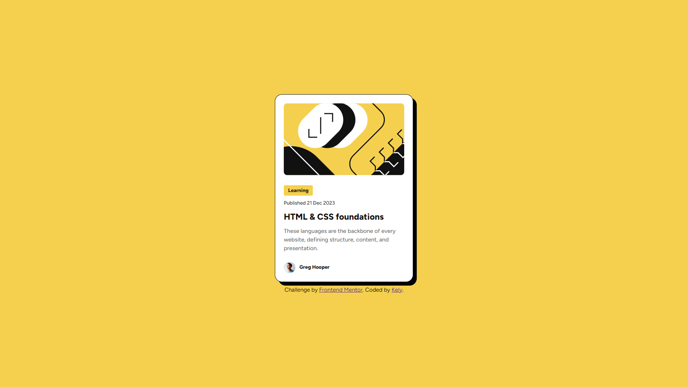

# Frontend Mentor - Blog preview card solution

This is a solution to the [Blog preview card challenge on Frontend Mentor](https://www.frontendmentor.io/challenges/blog-preview-card-ckPaj01IcS). Frontend Mentor challenges help you improve your coding skills by building realistic projects. 

## Table of contents

- [Overview](#overview)
  - [The challenge](#the-challenge)
  - [Screenshot](#screenshot)
  - [Links](#links)
- [My process](#my-process)
  - [Built with](#built-with)
  - [What I learned](#what-i-learned)
- [Author](#author)

## Overview

### The challenge

Users should be able to:

- See hover and focus states for all interactive elements on the page

### Screenshot



### Links

- Solution URL: [Github](https://github.com/Xoneris/frontend-mentor-blog-card)
- Live Site URL: [Github Pages](https://xoneris.github.io/frontend-mentor-blog-card/)

## My process

### Built with

- Semantic HTML5 markup
- CSS custom properties
- Flexbox
- responsive in mind
- love ♥

### What I learned

This was a very easy challenge. The only reason why I did it was because it was completely free, including the figma file which I appriciate. Because of it's simplicity I didnt learn much. One small thing I learned was fit-content as an option when defining the width of an element. Thats actually kinda convinient to know. 

```css
.tags {
  width: fit-content;
}
```

## Author

- Website - [Kely.dev](https://kely.dev)
- Frontend Mentor - [@Xoneris](https://www.frontendmentor.io/profile/Xoneris)